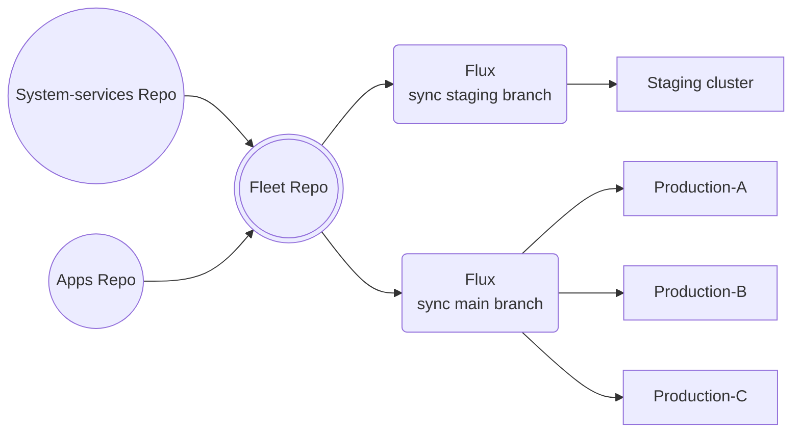

# keos-fleet

> [!NOTE]
> This repository is based on the `d1` reference architecture for the
> [ControlPlane Enterprise for Flux CD](https://github.com/controlplaneio-fluxcd/distribution/blob/main/guides/ControlPlane_Flux_D1_Reference_Architecture_Guide.pdf).

## Scope and Access Control

This repository is managed by the platform and operations teams who are responsible for the Kubernetes infrastructure and have direct access to the fleet of clusters.

The teams that manages this repository must have **cluster admin** rights to all clusters in the fleet to be able to perform the following tasks:

- Deploy Flux on fleet clusters (this is done by default by keos-installer).
- Configure the delivery of platform components (defined in [keos-system-services repository](https://github.com/Stratio/keos-system-services)).
- Configure the delivery of applications (defined in [keos-apps repository](https://github.com/Stratio/keos-apps)).



## GitHub Account for Flux

This account will be used by the Flux controllers running on clusters to authenticate with GitHub. The account is `flux-bot-stratio` and is managed by the Platform team.

The `flux-bot-stratio` GitHub account has the following permissions:

- Read and write access to the `keos-fleet` repository (required for cluster bootstrap)
- Push access to the `main` branch of the `keos-fleet` repository (required for cluster bootstrap)
- Read and write access to the `keos-system-services` and `keos-apps` repositories (required for cluster reconciliation)

### Flux GitHub PAT

The `flux-bot-stratio` GitHub account has a fine-grained personal access token with the following permissions for the `keos-system-services`, `keos-apps` and `keos-fleet` repositories:

- `Administration` -> `Access: Read-only`
- `Commit statuses` -> `Access: Read and write`
- `Contents` -> `Access: Read and write`
- `Metadata` -> `Access: Read-only`

This token will be stored in all clusters to authenticate with GitHub to pull the fleet desired state from the `keos-fleet`, `keos-system-services` and `keos-apps` repositories.

## Bootstrap Procedure

The bootstrap procedure is a one-time operation that sets up the Flux controllers on the cluster, and configures the delivery of platform components and applications.

After bootstrap, Flux will monitor the repository for changes and will reconcile itself from the Kubernetes manifests in the repository.

In AWS Marketplace installations, the bootstrap procedure is executed through the installation. If you want to execute it manually for testing purposes, you can follow the [manual bootstraping procedure](docs/manual-bootstraping.md)

### Rotate the Flux GitHub PAT

It is recommended to use GitHub fine-grained personal access tokens that expire. Before the Flux bot token expires, you should rotate the token by creating a new one and updating the `flux-system` secret in the `flux-system` namespace:

```shell
kubectl patch secret flux-system -n flux-system --type='merge' -p '{"data":{"password":"<BASE64_ENCODED_PASSWORD>"}}'
```

## Onboarding platform components

The platform team is responsible for onboarding the platform components defined in the [keos-system-services repository](https://github.com/Stratio/keos-system-services) and set the dependencies between the components.

To onboard a component from the `keos-system-services` repository, the platform team must add a
Flux Kustomization to the `domain/system-services/components` directory in the `keos-fleet` repository.

For example, the `keos-fleet` repository contains the following definitions for the `system-services` domain:

```shell
./domain/system-services/components/
├── gosec.yaml
└── monitoring.yaml
```

Which configures the reconciliation for the `keos-system-services` components defined in the `keos-system-services` repository:

```shell
./components/
├── gosec
│   ├── configs
│   │   ├── base
│   │   ├── talk-to-your-data
└── monitoring
│   ├── configs
│   │   ├── base
│   │   ├── talk-to-your-data
```

### Runtime configuration

In the `clusters/<cluster-name>/runtime-info.yaml` ConfigMaps, the platform team sets which configuration overlay to use for all components and from which branch to reconcile the changes.

For example, the `staging` cluster is configured to reconcile the `main` branch of the `keos-system-services` and `keos-apps` repositories, and to use the `talk-to-your-data` size `S` overlay for all components:

```yaml
apiVersion: v1
kind: ConfigMap
metadata:
  name: keos-runtime-info
  namespace: flux-system
  labels:
    toolkit.fluxcd.io/runtime: "true"
  annotations:
    kustomize.toolkit.fluxcd.io/ssa: "Merge"
data:
  STRATIO_USE_CASE: "talk-to-your-data"
  STRATIO_SIZE: "S"
  GIT_BRANCH: "main"
  CLUSTER_NAME: "staging"
  # ...omitted for brevity
```

The `keos-runtime-info` ConfigMap is propagated to all namespaces in a cluster by the `kubernetes-replicator`, and is used by all Flux Kustomizations to perform substitutions when reconciling the components.

The platform team can extend the `keos-runtime-info` ConfigMap with additional fields such as cluster region, cloud provider ID, etc.

## Onboarding platform applications

The platform team is responsible for onboarding the applications defined in the [keos-apps repository](https://github.com/Stratio/keos-apps) and set the dependencies between the components.

For each application use case, the Platform team must define the prerequisites and the components that make up that use case.


The directory structure under [domain/apps](https://github.com/Stratio/keos-fleet/tree/main/domain/apps) matches the components defined in the [keos-apps repository](https://github.com/Stratio/keos-apps/components).

For example, the `keos-fleet` repository contains the following definitions for the `talk-to-your-data` use case:

```shell
./domain/apps/talk-to-your-data/
├── components
│   ├── stratio-apps
|       ├── connectors-management
|       ├── kustomization.yaml
|       ├── namespace.yaml
|       ├── rbac.yaml
│   ├── stratio-datastores
|       ├── dg-s3-agent
|       ├── pgbouncer
|       ├── postgres
|       ├── postgres-agent
|       ├── kustomization.yaml
|       ├── namespace.yaml
|       ├── rbac.yaml
├── prerequisites
│   ├── kustomization.yaml
│   ├── source.yaml
│   └── tenant.yaml
```

Which configures the reconciliation for the `talk-to-your-data` components defined in the [keos-apps repository](https://github.com/Stratio/keos-apps/components):

```shell
./components/connectors-management/
├── base
│   ├── kustomization.yaml
│   ├── sync.yaml
│   └── values.yaml
├── S
│   ├── kustomization.yaml
│   ├── values.yaml
```

Changes made by the Platform team to the `keos-apps` repository in the `main` branch will be automatically reconciled by the Flux controllers running in the production cluster fleet.

Changes made by the Platform team to the `keos-apps` repository in the `staging` branch will be automatically reconciled by the Flux controllers running in the staging cluster fleet.

### Monitoring

To monitor the reconciliation process, run the following commands in different terminals:

```shell
watch flux get kustomizations --all-namespaces
```

