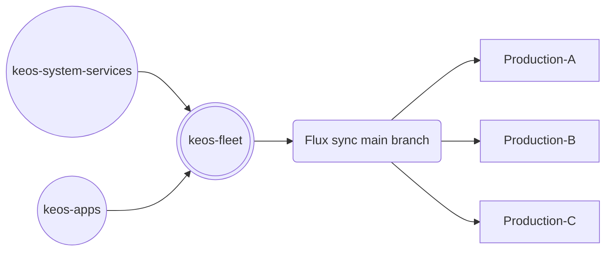

# keos-fleet

> [!NOTE]
> This repository is based on the `d1` reference architecture for the
> [ControlPlane Enterprise for Flux CD](https://github.com/controlplaneio-fluxcd/distribution/blob/main/guides/ControlPlane_Flux_D1_Reference_Architecture_Guide.pdf).
>
> The `d1` reference architecture comprised of
> [keos-fleet](https://github.com/Stratio/keos-fleet),
> [keos-system-services](https://github.com/Stratio/keos-system-services) and
> [keos-apps](https://github.com/Stratio/keos-apps)

## Scope and Access Control

This repository is managed by the platform and operations teams who are responsible for
the Kubernetes infrastructure and have direct access to the fleet of clusters.

The teams that manages this repository must have **cluster admin** rights to all clusters in the fleet to be able to perform the following tasks:

- Deploy Flux on fleet clusters (this is done by default with keos-installer).
- Configure the delivery of platform components (defined in [keos-system-services repository](https://github.com/Stratio/keos-system-services)).
- Configure the delivery of applications (defined in [keos-apps repository](https://github.com/Stratio/keos-apps)).



## GitHub Account for Flux

This account will be used by the Flux controllers running on clusters to authenticate with GitHub. The account is `flux-bot-stratio` and is managed by the Platform team.

The `flux-bot-stratio` GitHub account has the following permissions:

- Read and write access to the `keos-fleet` repository (required for cluster bootstrap)
- Push access to the `main` branch of the `keos-fleet` repository (required for cluster bootstrap)
- Read and write access to the `keos-system-services` and `keos-apps` repositories (required for cluster reconciliation)

### Flux GitHub PAT

The `flux-bot-stratio` GitHub account has a fine-grained personal access token with the following permissions for the `keos-system-services`, `keos-apps` and `keos-fleet` repositories:

- `Administration` -> `Access: Read-only`
- `Commit statuses` -> `Access: Read and write`
- `Contents` -> `Access: Read and write`
- `Metadata` -> `Access: Read-only`

This token will be stored in all clusters to authenticate with GitHub to pull the fleet desired state from the `keos-fleet`, `keos-system-services` and `keos-apps` repositories.

## Bootstrap Procedure

The bootstrap procedure is a one-time operation that sets up the Flux controllers on the cluster, and
configures the delivery of platform components and applications.

After bootstrap, Flux will monitor the repository for changes and will reconcile itself from the Kubernetes manifests in the repository.

### Bootstrap a cluster

Make sure to set the default context in your kubeconfig to your staging cluster, then create the prerequisites:

```shell
export FLUX_GITHUB_USER=$(echo 'flux-bot-stratio' | base64 -w0)
export FLUX_GITHUB_PAT=$(echo -n 'github_pat_xxx' | base64 -w0)
cat <<EOF | kubectl apply -f -
---
apiVersion: v1
kind: Namespace
metadata:
  name: flux-system
---
apiVersion: v1
kind: ServiceAccount
metadata:
  name: kustomize-controller
  namespace: flux-system
---
apiVersion: rbac.authorization.k8s.io/v1
kind: ClusterRoleBinding
metadata:
  name: cluster-reconciler-flux-system
roleRef:
  apiGroup: rbac.authorization.k8s.io
  kind: ClusterRole
  name: cluster-admin
subjects:
- kind: ServiceAccount
  name: kustomize-controller
  namespace: flux-system
---
apiVersion: v1
kind: Secret
metadata:
  annotations:
    replicator.v1.mittwald.de/replicate-to: .*
  name: flux-system
  namespace: flux-system
data:
  username: ${FLUX_GITHUB_USER}
  password: ${FLUX_GITHUB_PAT}
type: Opaque
EOF
```

Copy the cluster `_TEMPLATE` folder and replace the placeholders in the runtime configmap with the desired values:

```shell
export TARGET_DIR="keos-fleet/clusters/<CLUSTER_NAME>"

cp -r keos-fleet/clusters/_TEMPLATE "$TARGET_DIR"

find "$TARGET_DIR" -type f -exec sed -i "s/_CLUSTER_NAME/<CLUSTER_NAME>/g" {} +
find "$TARGET_DIR" -type f -exec sed -i "s/_STRATIO_SIZE/S/g" {} +
find "$TARGET_DIR" -type f -exec sed -i "s/_GIT_BRANCH/main/g" {} +
find "$TARGET_DIR" -type f -exec sed -i "s/_CLUSTER_DOMAIN/k8s.eosdev2.labs.stratio.com/g" {} +
find "$TARGET_DIR" -type f -exec sed -i "s/_CONTAINER_REGISTRY_URL/qa.int.stratio.com:11443/g" {} +
find "$TARGET_DIR" -type f -exec sed -i "s/_CONTAINER_REGISTRY_REPOSITORY_PREFIX//g" {} +
find "$TARGET_DIR" -type f -exec sed -i "s/_HELM_REGISTRY_PROVIDER/generic/g" {} +
find "$TARGET_DIR" -type f -exec sed -i "s/_HELM_REGISTRY_TYPE/default/g" {} +
find "$TARGET_DIR" -type f -exec sed -i "s/_HELM_REGISTRY_URL/http:\/\/qa.int.stratio.com/g" {} +
find "$TARGET_DIR" -type f -exec sed -i "s/_HELM_REGISTRY_REPOSITORY_PREFIX/\/repository/helm-all/g" {} +
find "$TARGET_DIR" -type f -exec sed -i "s/_SOPS_SECRET_PROVIDED/false/g" {} +
```

### Rotate the Flux GitHub PAT

It is recommended to use GitHub fine-grained personal access tokens that expire. Before the Flux bot token expires,
you should rotate the token by creating a new one and updating the `flux-system` secret in the `flux-system` namespace:

```shell
flux create secret git flux-system \
  --namespace=flux-system \
  --url=https://github.com \
  --username=git \
  --password=$NEW_GITHUB_TOKEN
```

## Onboarding platform components

The platform team is responsible for onboarding the platform components defined as Flux HelmReleases in the
[keos-system-services repository](https://github.com/controlplaneio-fluxcd/keos-system-services) and set the dependencies
between the components.

Platform components are cluster add-ons such as CRD and admission controllers,
and are reconciled by Flux as the **cluster admin**.

To onboard a component from the `keos-system-services` repository, the platform team must add a
Flux Kustomization to the `tenants/infra/components` directory in the `keos-fleet` repository.

For example, the `keos-fleet` repository contains the following definitions for the `infra` tenant:

```shell
./tenants/infra/components/
├── admission.yaml
└── monitoring.yaml
```

Which configures the reconciliation the `infra` components defined in the `keos-system-services` repository:

```shell
./components/
├── admission
│   ├── configs
│   │   ├── base
│   │   ├── production
│   │   └── staging
│   └── controllers
│       ├── base
│       ├── production
│       └── staging
└── monitoring
    ├── configs
    │   ├── base
    │   ├── production
    │   └── staging
    └── controllers
        ├── base
        ├── production
        └── staging
```

### Runtime configuration

In the `clusters/<cluster-name>/runtime-info.yaml` ConfigMaps, the platform team sets which
configuration overlay to use for all components and from which branch to reconcile the changes.

For example, the `staging` cluster is configured to reconcile the `main` branch of the `keos-system-services`
and `keos-apps` repositories, and to use the `staging` overlay for all components:

```yaml
apiVersion: v1
kind: ConfigMap
metadata:
  name: keos-runtime-info
  namespace: flux-system
  labels:
    toolkit.fluxcd.io/runtime: "true"
  annotations:
    kustomize.toolkit.fluxcd.io/ssa: "Merge"
data:
  ENVIRONMENT: "staging"
  GIT_BRANCH: "main"
  CLUSTER_NAME: "staging-1"
  CLUSTER_DOMAIN: "preview1.example.com"
```

The `keos-runtime-info` ConfigMap is propagated to all namespaces in a cluster by a Kyverno policy,
and is used by all Flux Kustomizations to perform substitutions when reconciling the components.

The platform team can extend the `keos-runtime-info` ConfigMap with additional fields such as
cluster region, cloud provider ID, etc.

## Onboarding tenants

The platform team is responsible for onboarding the applications defined as Flux HelmReleases in the
[keos-apps repository](https://github.com/controlplaneio-fluxcd/keos-apps) and restricting the access
to predefined Kubernetes namespaces.

### Flux GitHub PAT for tenant components

Create a GitHub fine-grained personal access token for the Flux bot account with
the following permissions for the `keos-apps` repository:

- `Administration` -> `Access: Read-only`
- `Commit statuses` -> `Access: Read and write`
- `Contents` -> `Access: Read and write`
- `Metadata` -> `Access: Read-only`

After the cluster is bootstrapped, the platform team can onboard tenant applications by creating
a Kubernetes secret in the `flux-system` namespace with the tenant's GitHub PAT:

```shell
export APPS_GITHUB_TOKEN=<Flux bot apps PAT>

flux create secret git flux-apps \
  --namespace=flux-system \
  --label=toolkit.fluxcd.io/tenant=apps \
  --url=https://github.com \
  --username=git \
  --password=$APPS_GITHUB_TOKEN
```

The tenant GitHub PAT secret is propagated from the `flux-system` namespace to all namespaces
where the tenant applications are running, using a Kyverno policy. When rotating the tenant GitHub PAT,
updating the `flux-apps` secret in the `flux-system` namespace will automatically propagate the new token
to all tenant namespaces labeled with `toolkit.fluxcd.io/tenant: apps`.

### Continuous Delivery for tenant applications

For each namespace belonging to a tenant, the platform team must define the Kubernetes
namespace, RBAC, Flux GitRepository and Kustomization custom resources under the
tenant's directory.

The directory structure under
[tenants/apps](https://github.com/controlplaneio-fluxcd/keos-fleet/tree/main/tenants/apps)
matches the components defined in the
[keos-apps repository](https://github.com/controlplaneio-fluxcd/keos-apps/components).

For example, the `keos-fleet` repository contains the following definitions for the `backend` namespace:

```shell
./tenants/apps/components/backend/
├── kustomization.yaml
├── namespace.yaml
├── rbac.yaml
└── sync.yaml
```

Which configures the reconciliation under a restricted service account for the `backend` components defined in the
[keos-apps repository](https://github.com/controlplaneio-fluxcd/keos-apps/components/backend):

```shell
./components/backend/
├── base
│   ├── bitnamicharts.yaml
│   ├── kustomization.yaml
│   ├── memcached.yaml
│   └── redis.yaml
├── production
│   ├── kustomization.yaml
│   ├── memcached-values.yaml
│   └── redis-values.yaml
└── staging
    ├── kustomization.yaml
    ├── memcached-values.yaml
    └── redis-values.yaml
```

Changes made by the dev team to the `keos-apps` repository in the `main` branch will
be automatically reconciled by the Flux controllers running in the staging cluster.

Changes made by the dev team to the `keos-apps` repository in the `production` branch will
be automatically reconciled by the Flux controllers running in the production cluster fleet.

The dev team can make any changes inside the namespaces assigned by the platform team, but they
cannot change any cluster-wide resources or the namespace itself.

### Helm release automation for tenant applications

The staging cluster runs the Flux image automation controllers which automatically
update the HelmRelease definitions in the `main` branch of the `keos-apps` repository
based on Flux image polices defined by the dev team.

When a new chart version is pushed to the container registry, and if it matches the semver policy,
Flux will update the HelmRelease YAML definitions and will push the changes to the `main` branch.

After the changes are reconciled on staging, the dev team can promote the changes
to the production clusters by merging the `main` branch into the `production` branch of the `keos-apps` repository.

The platform team is responsible for configuring a dedicated Kubernetes namespace for
the image policies and defining the Flux image update automation custom resources in the `keos-fleet` repository:

```shell
./tenants/apps/update/
├── automation.yaml
├── kustomization.yaml
├── namespace.yaml
├── rbac.yaml
└── sync.yaml
```

The above configuration will reconcile the image polices define in the
[keos-apps repository](https://github.com/controlplaneio-fluxcd/keos-apps/components):

```shell
./update/
├── backend-memcached.yaml
├── backend-redis.yaml
├── frontend-podinfo.yaml
└── kustomization.yaml
```

The dev team has full control over the image policies, and they are responsible for
defining the image update automation rules for their applications.
The platform team is responsible for setting up the infrastructure for running the
Flux image automation controllers and their access to the dev team repository.

## Bootstrap the production clusters

Make sure to set the default context in your kubeconfig to your production cluster, then run bootstrap with:

```shell
export GITHUB_TOKEN=<Flux platform PAT>

flux bootstrap github \
  --registry=ghcr.io/fluxcd \
  --owner=controlplaneio-fluxcd \
  --repository=keos-fleet \
  --branch=main \
  --token-auth \
  --path=clusters/prod-eu
```

After bootstrap, Flux will provision the production cluster with add-ons from `production`
branch of the `keos-system-services` repository.

To kick off the reconciliation of the tenant applications, the platform team must create the
`flux-apps` secret in the `flux-system` namespace with the tenant's GitHub PAT:

```shell
export APPS_GITHUB_TOKEN=<Flux apps PAT>

flux create secret git flux-apps \
  --namespace=flux-system \
  --label=toolkit.fluxcd.io/tenant=apps \
  --url=https://github.com \
  --username=git \
  --password=$APPS_GITHUB_TOKEN
```

After the `keos-system-services` repository reconciles, Flux will proceed to reconcile the tenant applications
from the `production` branch of the `keos-apps` repository.

### Monitoring

To monitor the reconciliation process, run the following commands in different terminals:

```shell
watch flux get kustomizations --all-namespaces
watch kubectl get pods --all-namespaces
```

To list all the managed resources by Flux, run:

```shell
flux tree ks flux-system
```

To view the Flux events with the reconciliation status, run:

```shell
flux events -A
```

### Grafana dashboards

To access Grafana, start port forward in a separate shell:

```shell
kubectl -n monitoring port-forward svc/kube-prometheus-stack-grafana  3000:80
```

Navigate to http://localhost:3000 in your browser and login with user `admin` and password `flux`.

Flux dashboards:

- Reconciliation stats: `http://localhost:3000/d/flux-cluster/flux-cluster-stats`
- Controller stats: `http://localhost:3000/d/flux-control-plane/flux-control-plane`

### KEOS Integration

export GITHUB_TOKEN=xxx

kubectl create secret generic flux-system \
--namespace kube-system \
  --from-literal=username=forselli-stratio \
  --from-literal=password=$GITHUB_TOKEN

kubectl annotate secret flux-system --namespace kube-system replicator.v1.mittwald.de/replicate-to=".*"

kubectl kustomize clusters/<CLUSTER_NAME>/flux-system | kubectl apply -f -
